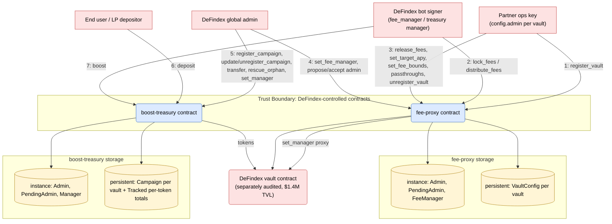

# STRIDE Threat Model — DeFindex APY Stabilizer

**Project:** DeFindex APY Stabilizer (boost-treasury + fee-proxy)
**Date:** 2026-05-21
**Author:** DeFindex Team
**Status:** Submitted to Stellar Security Audit Bank

---

## 1. What are we working on?

The APY Stabilizer is an add-on to the DeFindex multi-asset yield aggregator (live on Stellar mainnet, ~$1.4M TVL across 8 partner integrations; underlying vault separately audited by OtterSec, March 2025). It lets DeFindex programmatically smooth the realized APY presented to end users of partner vaults toward a partner-defined target (typically 4–6%), without DeFindex holding partner-level control rights.

Two Soroban contracts:

- **fee-proxy.** Holds the DeFindex vault's `Manager` role on behalf of partners. A DeFindex bot (`fee_manager` role) can call `lock_fees` / `distribute_fees` within partner-set bounds (`min_fee_bps`, `max_fee_bps`); the partner (`config.admin`) retains control of upgrades, fee receivers, emergency operations, rebalance manager, and the ability to unregister at any time.
- **boost-treasury.** Per-vault budget pot. Anyone can `deposit`; the manager (bot) can `boost` (transfer to a partner vault when APY undershoots target); admin can `transfer` to refund partners; admin can `rescue_orphan` to sweep untracked tokens.

### Data-flow diagram

### Numbered flows

1. **register_vault** — `config.admin` signs `fee-proxy.register_vault(admin, vault, config)`; proxy asserts `admin == config.admin`, calls `vault.set_manager(proxy)`, writes `VaultConfig(vault)`.
2. **lock_fees / distribute_fees** — bot (`fee_manager`) calls proxy; proxy passes through to the vault as Manager.
3. **partner ops on a vault** — `config.admin` calls `release_fees`, `set_target_apy`, `set_fee_bounds`, passthroughs (`upgrade_vault`, `rescue_vault`, `set_vault_manager`, etc.), or `unregister_vault`.
4. **proxy admin ops** — global admin calls `set_fee_manager`, `propose_admin`, `accept_admin`.
5. **treasury admin ops** — admin calls `register_campaign(vault, asset)`, `update_campaign`, `unregister_campaign`, `transfer`, `reallocate`, `rescue_orphan`, `set_manager`, `propose_admin`, `accept_admin`.
6. **deposit** — any account calls `treasury.deposit(caller, vault, amount)`; tokens transferred from caller to treasury; campaign accounting updated.
7. **boost** — bot (treasury `Manager`) calls `treasury.boost(vault, amount)`; treasury transfers tokens to vault.

### Trust boundaries

| ID  | Boundary | Trust Level |
|-----|----------|-------------|
| TB1 | DeFindex global admin | Root of trust on both contracts. Two-step propose/accept rotation. Expected to be a multisig or cold key. |
| TB2 | DeFindex bot signer | Semi-trusted, hot, single key. Holds `fee_manager` (proxy) and `Manager` (treasury). Compromise cannot redirect funds (vault_fee_receiver and boost destination remain partner-controlled), only forces unwanted fee schedules within partner-set bounds. |
| TB3 | Partner `config.admin` (per vault) | Semi-trusted; each partner controls their own vault's proxy-side state and can `unregister_vault` at any time. |
| TB4 | Underlying DeFindex vault | Separately audited (OtterSec, March 2025), live on mainnet. |

---

## 2. What can go wrong?

### STRIDE reminders

| Threat | Definition | Question |
|---|---|---|
| **S**poofing | Impersonating another user or system component. | Is the user who they say they are? |
| **T**ampering | Unauthorized alteration of data or code. | Has the data or code been modified? |
| **R**epudiation | Denying having taken an action. | Can we prove the user acted if they refute? |
| **I**nformation Disclosure | Over-sharing data expected to be kept private. | Is private information adequately protected? |
| **D**enial of Service | Negatively affecting service availability. | Can someone impact availability without authorization? |
| **E**levation of Privilege | Gaining additional privileges beyond what was granted. | Can someone gain extra privileges through legitimate or illegitimate means? |

### Threat table

| Threat | Issues |
|---|---|
| **S**poofing | **Spoof.1** — (Step 1) A partner whose UI or front-end is compromised could be induced to sign a `register_vault` where `config.admin` is substituted with an attacker address, handing proxy-side admin rights to an address that never authenticated. |
| **T**ampering | **Tamper.1** — (Steps 2, 7) Compromised bot key can call `lock_fees(max_fee_bps)` and/or `boost` across the entire registered fleet, forcing unwanted fee schedules and budget movement within partner-set bounds. **Tamper.2** — (Steps 6, 7) Tokens that arrive at the boost-treasury outside `deposit()` (direct sends, refunds from a vault, dust) are not counted in `total_deposited`; without an explicit recovery path, the contract's tracked accounting can diverge from real on-chain balance. |
| **R**epudiation | **Repudiate.1** — Bot operations (`lock_fees`, `distribute_fees`, `boost`) are signed by a single hot key; on-chain attribution is to the role, not to a specific human operator within DeFindex ops. |
| **I**nformation Disclosure | **Info.1** — All `VaultConfig` and `Campaign` fields are publicly readable on-chain (target APY, fee bounds, deposits, boost cadence). |
| **D**enial of Service | **DoS.1** — Single hot bot key is the only authorized `fee_manager` and treasury `Manager`. Bot-signer outage stops automated fee adjustment / boost until manual `set_fee_manager` rotation. **DoS.2** — No global pause flag; cross-fleet incident response requires N partner-side `unregister_vault` calls. **DoS.3** — (Step 5) `rescue_orphan` originally scanned one ledger entry per registered campaign; past ~197 campaigns the transaction could exceed Soroban's 200-entry read limit and become uncallable, delaying orphan-token recovery. |
| **E**levation of Privilege | **Elevation.1** — (Step 5) Admin can call `transfer(vault, amount, to)` to send up to `campaign.available()` tokens to any address, and `reallocate` to move budget between same-asset campaigns — by design (refunds, reallocation), documented power of the trusted admin role. **Elevation.2** — (Step 1) An attacker holding a partner's current vault Manager key could attempt to register the vault with `config.admin = attacker`, inheriting all proxy-side admin actions (`set_target_apy`, `set_fee_bounds`, passthroughs, `release_fees`) for that vault. |

---

## 3. What are we going to do about it?

| Threat | Mitigations |
|---|---|
| **S**poofing | **Spoof.1** / **Elevation.2** — **S1R1 (FIXED in code).** `register_vault` requires the signer to be `config.admin` (`config.admin.require_auth()`), so proxy-side admin rights can only go to an address that authenticated. Tracked as audit finding H1; the original equality-check + `AdminMismatch` (#3024) was simplified by external finding **B01** (param removed, error variant deleted) — same invariant, smaller surface. **S1R2.** Partner onboarding docs surface `config.admin` clearly before signing. |
| **T**ampering | **Tamper.1** — **T1R1.** Bot signer key managed through isolated secret-storage with restricted access; key rotation and access reviews on a defined cadence. **T1R2.** Off-chain event-stream monitoring on `FeesLocked`, `FeesDistributed`, `Boosted`; admin can rotate the bot key with one tx (`set_fee_manager(burner)` / `set_manager(burner)`) on suspicion. **T1R3.** Risk-accepted by design (audit M9): single-key compromise cannot redirect funds — `vault_fee_receiver` is partner-controlled; recovery via `unregister_vault` + `release_fees` or boost-treasury top-up. **Tamper.2** — **T2R1 (FIXED in code).** Admin-only `rescue_orphan(token, to, amount)` added to boost-treasury, bounded by `balance(token) - Tracked(token)`, where `Tracked(token)` is a per-token running total of every campaign's `available()` for that token (maintained on `deposit`/`boost`/`transfer`). The function cannot drain campaign-tracked funds by construction. Tracked as audit finding M3; the bound was originally computed by scanning a `CampaignList`, replaced by the O(1) per-token counter under external finding **A01** (see DoS.3). |
| **R**epudiation | **Repudiate.1** — **R1R1.** Every state-changing call emits a typed event (`FeesLocked`, `FeesDistributed`, `FeesReleased`, `Boosted`, `Deposited`, `Transferred`, `Reallocated`, `OrphanRescued`, role-rotation events). Off-chain monitoring archives event streams for cross-referencing with bot operational logs. Per-human attribution within DeFindex ops is out of scope of the contract layer. |
| **I**nformation Disclosure | **Info.1** — **I1R1.** Risk-accepted. On-chain transparency is intentional; no PII or off-chain identifiers stored in either contract. Partners are made aware at integration time that fee bounds and target APY are public. |
| **D**enial of Service | **DoS.1** — **D1R1.** Bot infra hosted with multi-region redundancy where feasible; runbook for admin-triggered `set_fee_manager` / `set_manager` rotation if the primary signer is unavailable. Worst-case state during outage is "fee rate stays at its last value" — no fund loss, only target-tracking drift. Partner-side `release_fees` and `unregister_vault` remain operational regardless. **DoS.2** — **D2R1.** Risk-accepted (audit M7). Existing primitives provide most of the kill-switch behavior in one tx: `set_fee_manager(burner)` on the proxy and `set_manager(burner)` / `update_campaign(active=false)` on the treasury. A global pause flag was considered and rejected as redundant. **DoS.3** — **D3R1 (FIXED in code).** The `rescue_orphan` per-campaign scan was replaced by an O(1) per-token `Tracked` counter (external finding **A01**), so the function reads exactly two ledger entries regardless of campaign count and cannot be bricked by campaign growth. The `deposit`/`boost`/`transfer` hot paths were already O(1). A campaign cap was therefore unnecessary. |
| **E**levation of Privilege | **Elevation.1** — **E1R1 (FIXED in code).** `transfer()` docstring rewritten to clearly document the admin drain power and direct users to `rescue_orphan` for orphan balances; a dedicated admin-only `reallocate(from, to, amount)` (external finding **B08**) moves budget between same-asset campaigns without funds leaving the treasury (net-zero on the per-token `Tracked` total). **E1R2.** Admin key custody in cold storage / multisig (off-chain control). Tracked as audit finding L4. **Elevation.2** — see Spoof.1 mitigations. |

---

## 4. Did we do a good job?

- **DFD referenced after creation?** Yes — used to enumerate the seven numbered flows and to cross-reference each Almanax automated-scan finding against an in-DFD flow.
- **Did STRIDE uncover new design issues?** Yes. **Spoof.1 / Elevation.2** (`config.admin` not authenticated in `register_vault`) → fixed by H1's `AdminMismatch` assertion (later simplified by external B01). **Tamper.2** (stranded orphan tokens) → fixed by M3's `rescue_orphan`, whose bound is now the O(1) per-token `Tracked` counter (external A01). **DoS.2** (no global pause) → reviewed and risk-accepted because existing primitives already cover the use case. **DoS.3** (`rescue_orphan` unbounded reads, external A01) → fixed by the per-token counter.
- **Did the treatments adequately address the issues?** Yes for the code-level fixes (H1, M3, L2, L3, L4, L5, plus external A01/B01–B04/B06–B08 — all merged, all tests passing, both contracts build clean). Risk-accepted items (M5, M6, M7, M8, M9, and external A02/B05) have documented operational mitigations and explicit rationale. See `internal-audit.md` §1a for the external-audit remediation table.
- **Additional issues found post-model?** Cross-referencing against Almanax surfaced four findings that were verified false positives against Soroban platform guarantees (CAP-0058 host-reserved `__constructor`; Protocol 23+ auto-restoration of archived storage; Soroban's invocation-bound `require_auth`). Documented in `internal-audit.md` with protocol-level citations.
- **Process improvements next time?** Anchor Soroban threat models on protocol-level guarantees first (CAP-0058, Protocol 23+ auto-restoration, invocation-bound `require_auth`) — these eliminate large categories of generic Web3 anti-patterns before they reach the threat table. External scanners often lag the protocol and should be reviewed with that lens.
